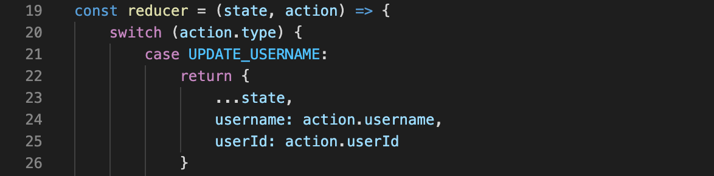

## Table of Content
- Objective
- Deployed Link
- Getting Started
- Code Highlights
- Technologies
- Authors

## Technologies
* [HTML](https://developer.mozilla.org/en-US/docs/Web/HTML)
* [CSS](https://developer.mozilla.org/en-US/docs/Web/CSS)
* [Javascript](https://developer.mozilla.org/en-US/docs/Web/JavaScrip)
* [Heroku](https://www.heroku.com/)
* [MySQL](https://www.mysql.com/)
* [Express](https://expressjs.com/)
* [React](https://reactjs.org/)
* [Node.js](https://nodejs.org/en/)
* [Sequelize](https://sequelize.org/)
* [Passport.js](http://www.passportjs.org/)
* [Axios](https://www.npmjs.com/package/axios)
* [React-Color](https://casesandberg.github.io/react-color/)
* [React-Scheduler](https://devexpress.github.io/devextreme-reactive/react/scheduler/docs/guides/fundamentals/)
## Deployed Link

## Getting Started
These instructions will get you a copy of the project up and running on your local machine for development and testing purposes. See deployment for notes on how to deploy the project on a live system.


Then open in your preferred text editor:
- [vim](https://www.vim.org/) 
- [emmacs](https://www.gnu.org/software/emacs/)
- [visual studio code](https://code.visualstudio.com/) 

To install dependencies, run this command.

```
npm install
```

You will need to create the development database by running the following command in MySQL Workbench or the MySQL command line interface.

```SQL
CREATE DATABASE chore_db;
```

To start the development server, execute this command in the terminal.

```
npm start
```

## Code Highlights

We keep store data on the frontend in a global state created with `useReducer`. The part of the reducer function that updates the current user's name and ID is shown below.



The information stored in the global state is used throughout the React application. One such place is in `App.js` where we handle routing using `react-router-dom`. The existance of `state.username` indicates that the user is logged in, which determines which set of routes are available.

```jsx
// check if the user is logged in
state.username ?
  // in the case where the user is logged in, reroute away fron login or signup
  <Switch>
    <Redirect exact path={["/", "/login"]} to="/dashboard" />
    <Redirect exact path="/signup" to="/household" />
    <Route exact path="/dashboard" component={Dashboard} />
    <Route exact path="/household" component={Household} />
    <Route exact path="/chores" component={Chores} />
  </Switch> :
  // in the case where the user is not logged in, reroute to login
  <Switch>
    <Redirect exact path={["/", "/dashboard", "/household", "/chores"]} to="/login" />
    <Redirect exact path="/" to="/login" />
    <Route exact path="/login" component={Login} />
    <Route exact path="/signup" component={SignUp} />
  </Switch>
```

